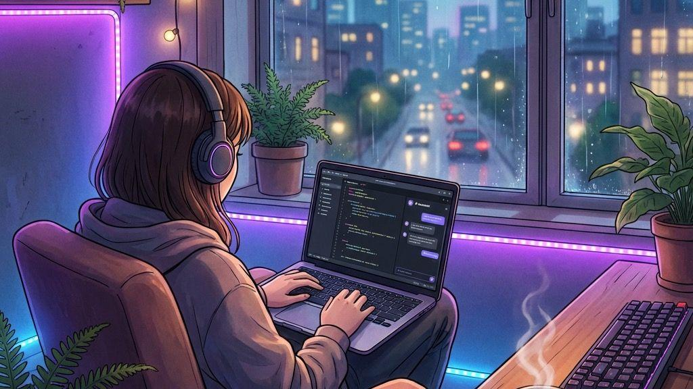

  

<!-- INTRO -->

<h1 align="center">hey, i'm Punam ♡</h1>

  <em>frontend developer in progress · MCA student</em>

  building things, fixing bugs, and learning as i go.
   
  currently exploring React and open source.

  

<!-- ABOUT ME -->

<h3 align="center">✧ a little about me ✧</h3>

* 🌱 Currently learning **Typescript, NextJS**
* 💻 Building web projects and improving my JavaScript
* 🐛 Exploring open-source contributions
* ✨ Interested in frontend development and AI-powered apps
* 🎧 Usually coding with music on

<!-- TECH STACK -->

<h3 align="center">⌘ tools i work with</h3>

  
  
  
  
  
  

<!-- PROJECTS -->

## ✧ things i've built ✧

<table>
<tr>
<td width="50%" valign="top">

### ☾ BuddyGPT

A ChatGPT-style interface with dark/light mode, a sidebar, and formatted responses.

  

  <a href="https://github.com/pun4m-srestha/BuddyGPT">View repository ↗</a>

**Tech:** JavaScript · Frontend

</td>
<td width="50%" valign="top">

### 🏡 Homigo

A rental listing application with authentication, listing management, and reviews.

  

  <a href="https://github.com/pun4m-srestha/Homigo">View repository ↗</a>

**Tech:** Node.js · Express · MongoDB

</td>
</tr>
</table>

<!-- OPEN SOURCE -->

<h3 align="center">⌁ open source journey</h3>

Currently exploring existing codebases, fixing issues, and learning from the community.

* Contributed an image alt-text improvement to Vaadin Web Components.
* Learning how to make useful, maintainable contributions.

  <a href="https://github.com/pun4m-srestha?tab=repositories">Explore my repositories ↗</a>
  ·
  <a href="https://github.com/pun4m-srestha?tab=stars">Things I find interesting ↗</a>

## ✧ github activity ✧

  
  

## ✧ consistency over perfection ✧

  

  <i>small steps, good code, better every day ♡</i>

<!-- FOOTER -->

  <em>small steps, good code, better every day ♡</em>

  

